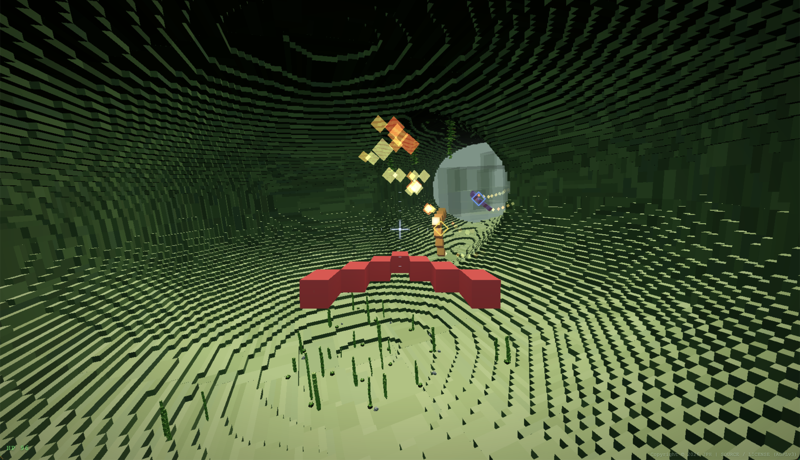

# Rocket3D

Rocket3D is a fast arcade voxel flight game for the web, inspired by the feel
of 1990s cave-flying games like `Wings` (1996) and `AUTS` (1995). It is an
original open-source implementation rebuilt as a fully 3D WebGL game: pixel
becomes voxel, and the player flies a small rocket through cave systems,
chambers, and destructible underground spaces.

The current version is an early engine-focused release. The goal is to make the
core voxel world feel worth flying through before adding progression, scoring,
or campaign structure.



## Current Focus

- Third-person rocket flight through large voxel cave spaces
- Deterministic voxel terrain with chunk streaming
- Runtime terrain destruction and remeshing
- Collision against generated and modified terrain
- Mid/far LOD terrain rendering for larger spaces
- Basic weapons, AI opponents, particles, flames, sound effects, and tracker
  music playback
- Decorative cave detail

## What's Broken / What's Next

The game is nowhere near complete. The biggest rough edges right now are LOD
presentation and loading - placeholder geometry and preview chunks can look
like bugs when they pop up near the player.

- **LOD visual contract**: define explicit roles, distance ranges, and
  replacement rules for each LOD layer so preview blocks never draw inside
  loaded chunks near the player.
- **Startup loading**: stop showing coarse preview geometry where the player
  can immediately fly into it.
- **Sky openings**: make them convincing carved geometry instead of sky cards
  the player can approach from the side.
- **Cave lighting**: tune ambient, sun, fog, and material brightness per level
  so ceilings and hazards read clearly.
- **Navigation landmarks**: add obvious anchors (pillars, arches, platforms) to
  large chambers.
- **Material variety**: break up the "single green cave" look with stronger
  contrast between floor, wall, and ceiling surfaces.

## Controls

### Player Controls

- **Arrow keys**: pitch and roll
- **Space**: thrust
- **X**: fire current weapon
- **C**: cycle weapons
- **Y**: toggle crosshair
- **Z**: cycle camera perspective
- **W/A/S/D**: adjust camera height/orbit
- **P**: pause
- **R**: reset camera
- **F**: fullscreen
- **H**: toggle HUD
- **M**: cycle music (**Shift+M**: cycle reverse)
- **N**: toggle sound effects
- **I**: toggle AI

### Debug & Developer Controls

- **T**: toggle dev statistics overlay
- **B**: toggle chunk boundaries
- **0 / 1 / 2 / 3**: toggle individual LOD levels
- **L**: cycle LOD debug mode: normal, identity colors, wireframe, disabled
- **O**: show LOD shell statistics

Gamepad support is experimental. It has only been tested with one controller in
Firefox, where the browser exposes raw input mappings; Chrome or other
controllers may need mapping adjustments in `src/controls.js`.

## Development

```sh
npm install
npm run dev
```

Useful commands:

```sh
npm run build
npm run lint
npm run format
npm run preview
```

The project uses Three.js, Vite, JavaScript modules, Web Workers, and procedural
voxel terrain generation.

## Browser Terrain Cache

Rocket3D keeps a browser-local terrain cache for generated chunk and LOD mesh
data, so repeat visits can reuse deterministic terrain instead of rebuilding
everything from scratch. The cache is treated as an optimization, not as a
gameplay dependency: startup may load from it, but normal flight-time chunk
streaming still prioritizes fresh worker generation so nearby full-detail
terrain, collision, and destruction stay responsive.

If the cache is missing, stale, cleared, or unavailable, the game falls back to
normal terrain generation. To clear the terrain cache for the current browser
origin, start the game with `?clearTerrainCache=1`.

## License and copyright

Rocket3D is released under the **GNU Affero General Public License v3.0**. See `LICENSE.txt` for the full text.

Copyright 2026 JPH.

**NO WARRANTY**: This program is distributed in the hope that it will be useful, but WITHOUT ANY WARRANTY; without even the implied warranty of MERCHANTABILITY or FITNESS FOR A PARTICULAR PURPOSE.

The source code is available at: [https://github.com/jphd3v/rocket3d](https://github.com/jphd3v/rocket3d)

The bundled music is permissively-licensed tracker music downloaded from https://modarchive.org. Kudos to Drozerix, Kokesz, K. Jose, and JAM for releasing their music for the public! See `public/music/README.md` for technical notes.

| Track               | File                              | Author   | License       | Link                                                                                     |
| ------------------- | --------------------------------- | -------- | ------------- | ---------------------------------------------------------------------------------------- |
| A Winter Kiss       | `a_winter_kiss.xm`                | Drozerix | Public Domain | [modarchive.org](https://modarchive.org/index.php?request=view_by_moduleid&query=174546) |
| Cabin Fever         | `cabin_fever.xm`                  | Drozerix | Public Domain | [modarchive.org](https://modarchive.org/index.php?request=view_by_moduleid&query=174833) |
| Chica-pop!          | `drozerix_-_chica-pop!.xm`        | Drozerix | Public Domain | [modarchive.org](https://modarchive.org/index.php?request=view_by_moduleid&query=189433) |
| War Path            | `drozerix_-_war_path.xm`          | Drozerix | Public Domain | [modarchive.org](https://modarchive.org/index.php?request=view_by_moduleid&query=190185) |
| Mecanum Overdrive   | `drozerix_-_mecanum_overdrive.xm` | Drozerix | Public Domain | [modarchive.org](https://modarchive.org/index.php?request=view_by_moduleid&query=175349) |
| natural_vision      | `natural.xm`                      | Kokesz   | Public Domain | [modarchive.org](https://modarchive.org/index.php?request=view_by_moduleid&query=174357) |
| Enemy Influx        | `k_jose_-_enemy_influx.s3m`       | K. Jose  | CC0           | [modarchive.org](https://modarchive.org/index.php?request=view_by_moduleid&query=190562) |
| Dangerous Radiation | `dangeradiation.xm`               | JAM      | Public Domain | [modarchive.org](https://modarchive.org/index.php?request=view_by_moduleid&query=169047) |
